# Wpay — Flutter E-Wallet

A pixel-faithful e-wallet mobile app built in Flutter from the **"Wpay – E-Wallet Mobile App UI Kit"** (DhuhaCreative). Every screen from the kit is recreated, and the flows the kit didn't show (onboarding, auth, email verification, Face ID, full home) were designed in the same visual language.

<p align="center">
  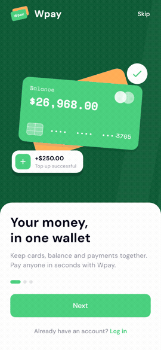
</p>

<p align="center"><em>Onboarding → Sign up → Face ID → Home → Transfer → Top up → History</em></p>

## Features

- **Onboarding & auth** — 3 onboarding pages, login, sign up, email verification, forgot/reset password
- **Face ID** — animated face-scan unlock screen
- **Home & dashboard** — Home, Statistics, Notifications and Profile tabs
- **Transfers** — Transfer with Wally, Transfer with Bank, confirmation and receipt screens
- **Top up** — choose method, add card (with simulated card scan), or bank transfer with a step-by-step virtual-account guide
- **Payment history** — sortable transactions with a filter bottom sheet
- **Scan QR** — in-app QR scanner screen
- **Live state** — transfers and top-ups update the running balance and transaction list (in-memory sample data in `lib/state.dart`)

## Screenshots

| Onboarding | Login | Face ID | Home |
|:---:|:---:|:---:|:---:|
|  | 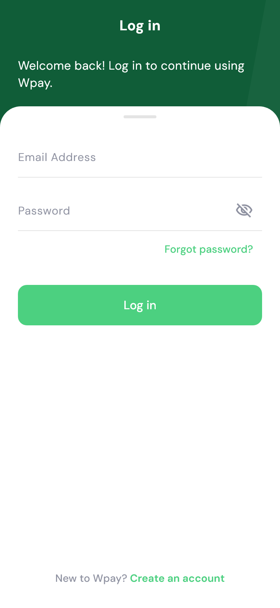 | 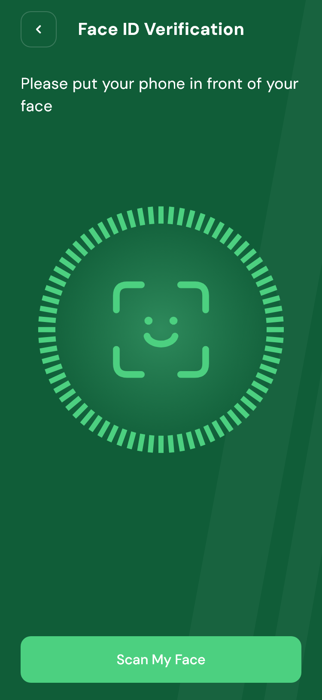 | 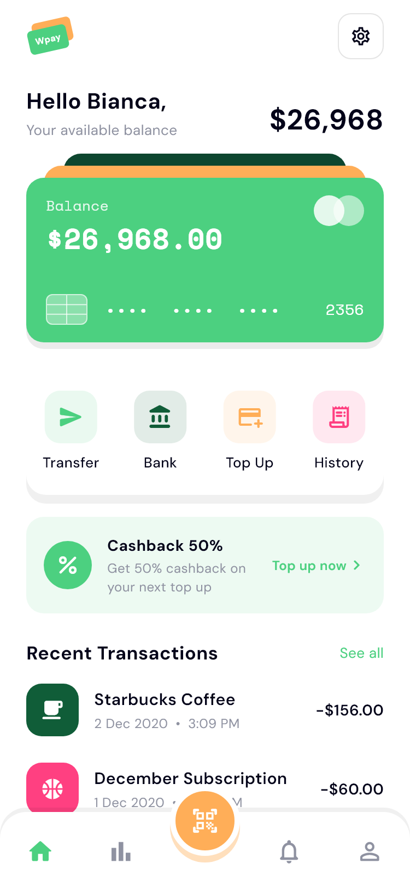 |

| Statistics | Transfer with Wally | Confirm Transfer | Receipt |
|:---:|:---:|:---:|:---:|
| 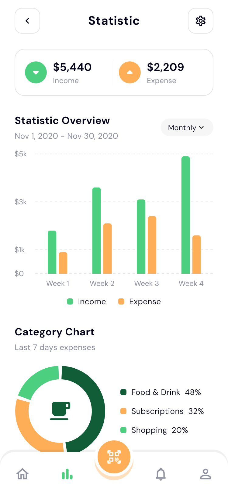 | 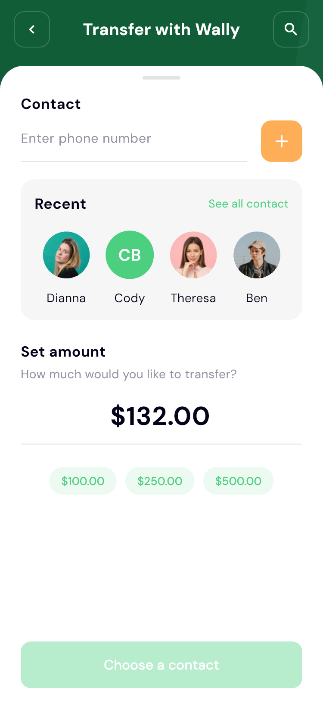 | 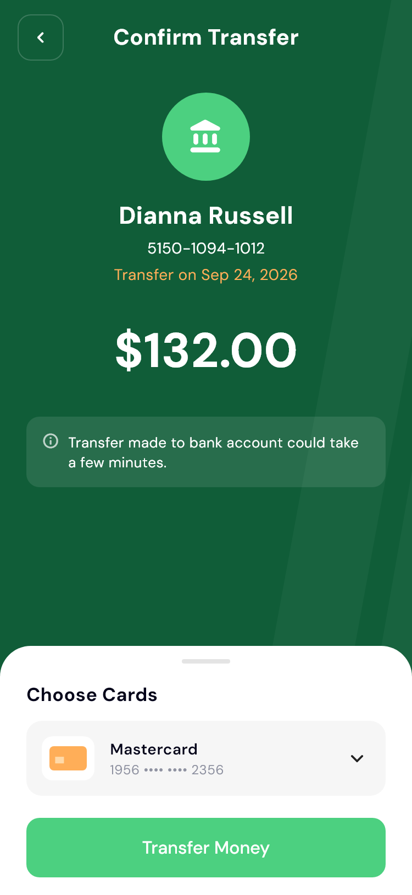 | 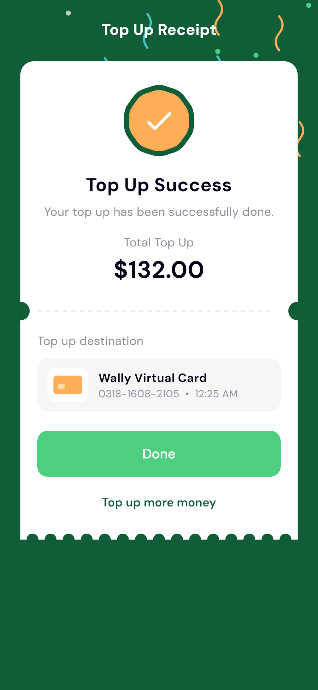 |

| Top Up Method | Top Up with Card | Top Up with Bank | Payment History |
|:---:|:---:|:---:|:---:|
| 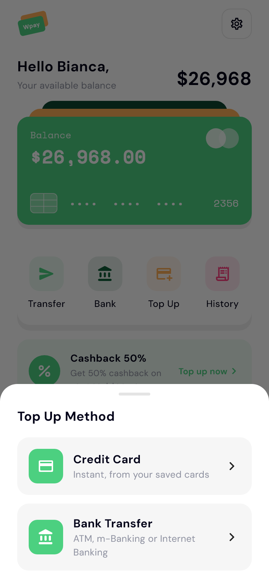 | 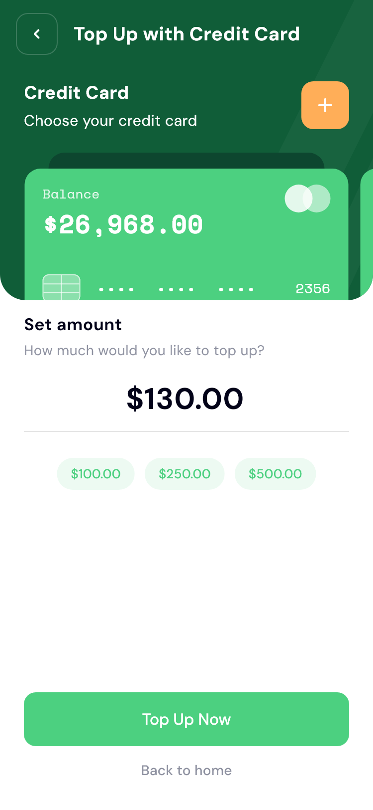 | 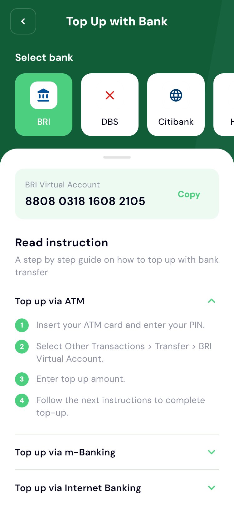 | 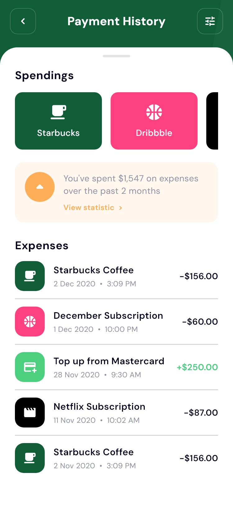 |

| History Filter | Transfer with Bank | Add New Card | Scan QR |
|:---:|:---:|:---:|:---:|
| 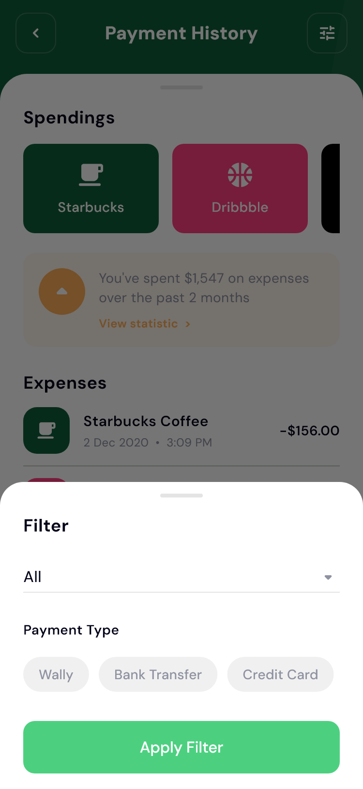 | 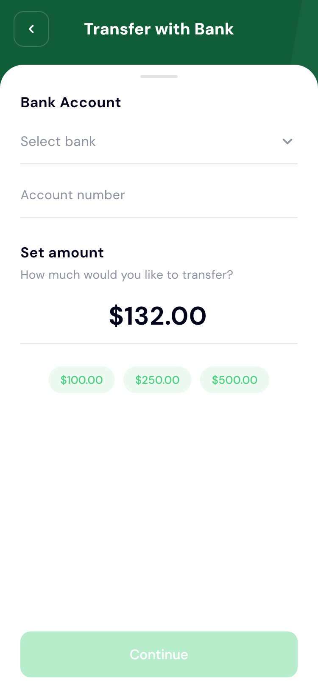 | 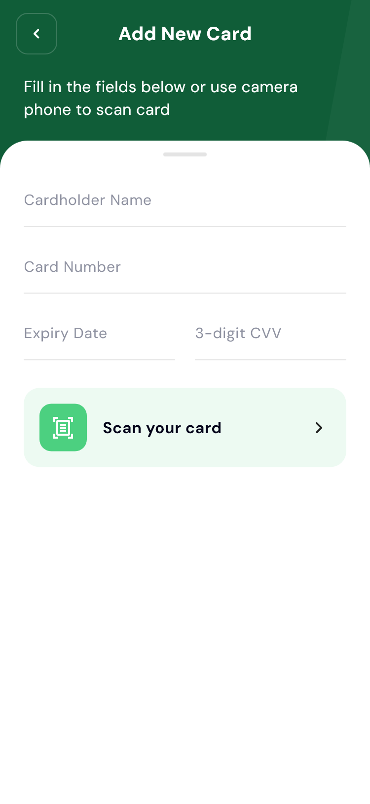 | 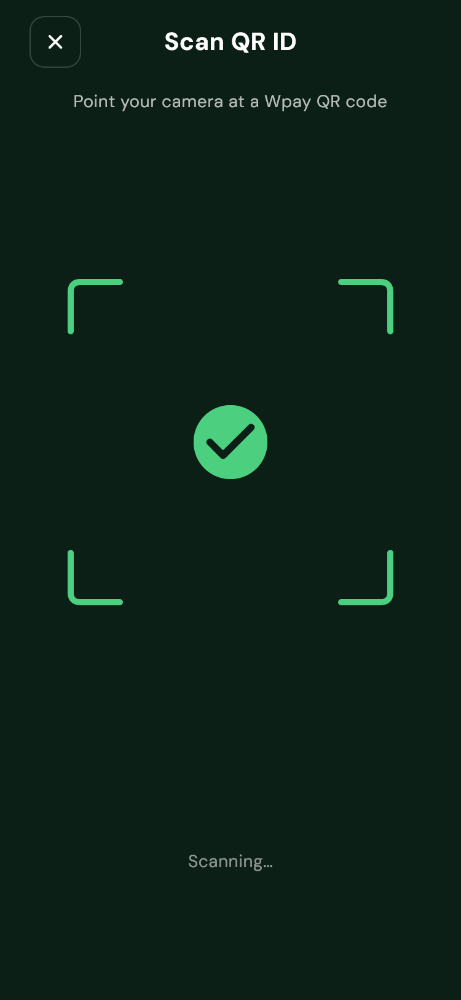 |

## Flow

```
Onboarding → Sign up → Email verification → Face ID → Home
Log in     → Home
Forgot password → Email verification → New password → Log in

Home tabs: Home · Statistic · (Scan QR) · Notification · Profile

From Home:  Transfer with Wally → Confirm Transfer → Receipt
            Transfer with Bank
            Top Up Method → Top Up with Credit Card → Top Up Receipt
                          → Top Up with Bank (virtual account + guide)
            Add New Card (simulated card scan)
            Payment History (with filter sheet)
```

## Getting started

Requires the [Flutter SDK](https://docs.flutter.dev/get-started/install) (Dart `^3.11.4`).

```bash
flutter pub get
flutter run
```

## Project structure

```
lib/
  main.dart            – app entry & routing
  theme.dart           – colours sampled from the kit; DM Sans + Space Mono
  state.dart           – in-memory user, cards, contacts, transactions
  widgets/
    common.dart        – green header page, buttons, fields, balance card
    face_scan.dart     – Face ID scanner animation
  screens/
    onboarding.dart    – onboarding pages
    auth.dart          – login, sign up, verify, forgot/reset password
    shell.dart         – bottom-nav shell
    tabs.dart          – home, statistics, notifications, profile
    transfer.dart      – transfer with Wally / bank, confirm, receipt
    topup.dart         – top up method & card
    topup_bank.dart    – bank top up + virtual account guide
    history.dart       – payment history & filter sheet
    scan.dart          – QR scanner
assets/
  fonts/               – DM Sans + Space Mono
  images/              – avatars & illustrations
docs/screenshots/      – README screenshots
media/                 – demo video & GIF
```

## Regenerating the screenshots

`test_screens/shots_test.dart` renders every screen to PNG with the real bundled
fonts, so the app can be compared side by side against the Figma design:

```bash
flutter test test_screens --update-goldens
# output: test_screens/out/*.png  (copied into docs/screenshots/)
```

## Credits

Design based on the **Wpay – E-Wallet Mobile App UI Kit** by [DhuhaCreative](https://www.figma.com/community).
Flutter implementation, custom screens and demo assets by [TanimowoObaloluwaDavid](https://github.com/TanimowoObaloluwaDavid).
